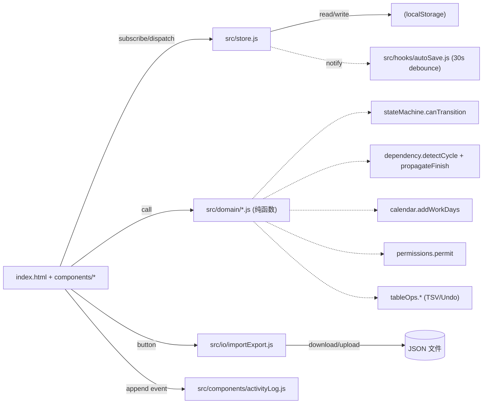
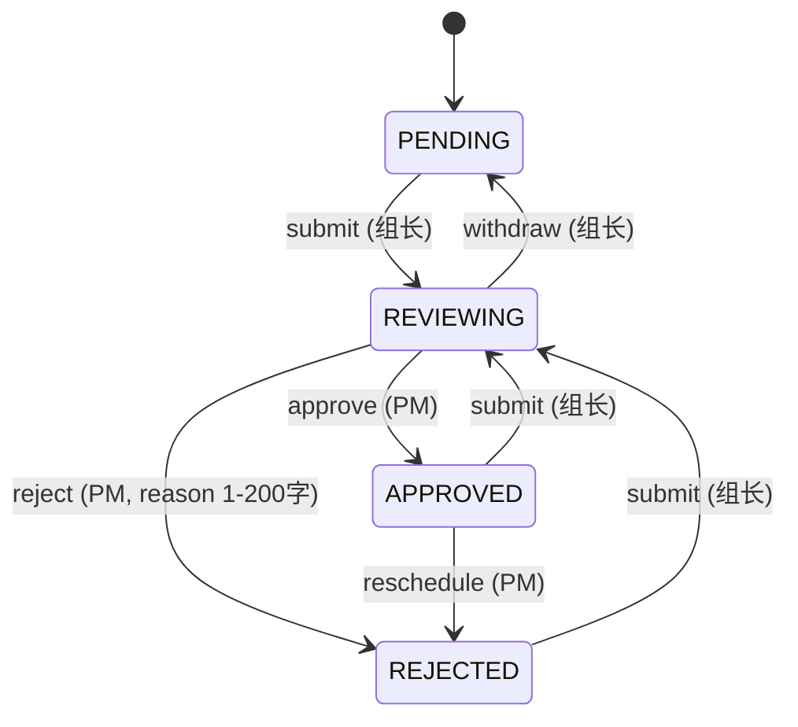

# OA MVP — 架构文档

## 1. 系统架构



## 2. 目录结构

```
/home/rhonin/oa/
├── index.html
├── styles.css
├── src/
│   ├── main.js                  # 组装：读 store → 挂载各组件
│   ├── seed.js                 # 2 项目 × 1 迭代 × 2 组 × 5 任务 + 3 用户
│   ├── store.js                # 订阅式状态 + localStorage 同步
│   ├── io/importExport.js      # 下载 / 上传 JSON
│   ├── hooks/autoSave.js        # 30s 防抖保存
│   ├── domain/                  # 纯函数（可测）
│   │   ├── stateMachine.js
│   │   ├── permissions.js
│   │   ├── calendar.js
│   │   ├── dependency.js
│   │   └── tableOps.js
│   └── components/
│       ├── roleSwitcher.js
│       ├── projectTree.js
│       ├── wbsTable.js
│       ├── approvalPanel.js
│       ├── activityLog.js
│       └── toast.js
├── tests/                      # node --test
│   ├── stateMachine.test.js
│   ├── permissions.test.js
│   ├── calendar.test.js
│   ├── dependency.test.js
│   └── tableOps.test.js
└── docs/
```

## 3. 数据流

```
用户操作 → components/*.js → store.setState()
store.setState() → localStorage + 通知所有 subscriber
subscriber → re-render 相关 UI
```

## 4. 状态机（与需求书一致）



## 5. 主从同步语义

- 总表 = `tasks.filter(t => t.source === 'MASTER' || (t.source === 'GROUP' && schedule.status === 'APPROVED'))`
- PM 在总表新增行 → `source='MASTER'` 写入对应组
- 删除：MASTER 行随时可删；GROUP 行不可删（由审批状态保护）

## 6. 关键风险与缓解

| 风险 | 缓解 |
|------|------|
| localStorage 5MB 上限 | try/catch 包裹；超限提示用户导出 |
| ES Module file:// 协议限制 | README 强制要求 `python3 -m http.server` |
| WBS 表格性能 | 整表 diff 重绘；总任务量 ~50 行量级可接受 |
| 依赖时间联动出错 | `dependency.js` + `calendar.js` 纯函数 100% 单测覆盖 |
