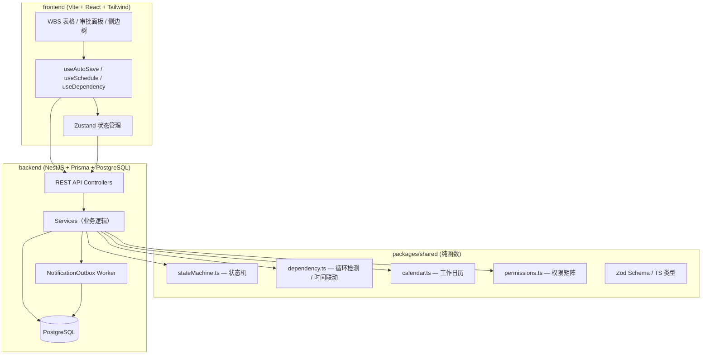
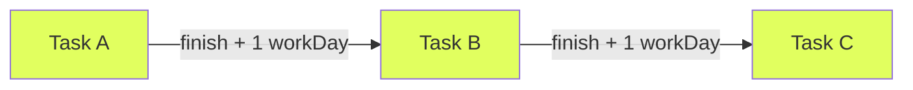

# OA 平台 MVP 架构文档

## 1. 系统架构图



## 2. 数据模型（Prisma Schema）

```prisma
// packages/shared/src/schema.prisma（backend 复制使用）

model User {
  id      String  @id @default(cuid())
  name    String
  role    Role
  groupId String?
  group   Group?  @relation(fields: [groupId], references: [id])
}

model Group {
  id      String @id @default(cuid())
  name    String
  members User[]
}

model Project {
  id         String      @id @default(cuid())
  name       String
  iterations Iteration[]
}

model Iteration {
  id         String          @id @default(cuid())
  projectId  String
  project    Project         @relation(fields: [projectId], references: [id])
  name       String
  startDate  DateTime
  endDate    DateTime
  schedules  GroupSchedule[]
}

model GroupSchedule {
  id           String          @id @default(cuid())
  iterationId  String
  iteration    Iteration       @relation(fields: [iterationId], references: [id])
  groupId      String
  status       ScheduleStatus
  version      Int             @default(1)  // 乐观锁
  rejectReason String?
  tasks        Task[]
  createdAt    DateTime        @default(now())
  updatedAt    DateTime        @updatedAt
}

model Task {
  id                String    @id @default(cuid())
  scheduleId        String
  schedule          GroupSchedule @relation(fields: [scheduleId], references: [id])
  orderIndex        Int
  name              String
  ownerId           String?
  startDate         DateTime?
  endDate           DateTime?
  durationDays      Int?
  dependencyTaskId  String?   // 1-to-1 前置依赖
  source            TaskSource @default(GROUP)
  // source = GROUP  来自组长编辑
  // source = MASTER PM 在总表手动新增
}

model ApprovalRecord {
  id          String   @id @default(cuid())
  scheduleId  String
  reviewerId  String
  action      String   // APPROVE | REJECT | RESCHEDULE
  reason      String?
  createdAt   DateTime @default(now())
}

model NotificationOutbox {
  id            String    @id @default(cuid())
  idempotencyKey String   @unique
  type          String    // SCHEDULE_SUBMITTED | SCHEDULE_APPROVED | RESCHEDULE | MEMO_MENTIONED
  payload       Json
  dispatchedAt  DateTime?
  createdAt     DateTime  @default(now())
}

enum Role {
  GROUP_LEADER
  PROJECT_MANAGER
}

enum ScheduleStatus {
  PENDING
  REVIEWING
  APPROVED
  REJECTED
}

enum TaskSource {
  GROUP
  MASTER
}
```

## 3. 主从同步语义

```
总表（Master） = APPROVED 组任务（source=GROUP）+ PM 手动行（source=MASTER）

正向同步（Group → Master）：
  schedule.status: REVIEWING → APPROVED
  → INSERT/UPDATE Task records with source=GROUP into master view

反向同步（Master → Group）：
  PM 在总表新增一行（POST /master/:iterationId/rows）
  → INSERT Task with source=MASTER into corresponding GroupSchedule
  → NotificationOutbox: 2条（owner + group leader）

删除约束：
  source=GROUP 的行 — PM 不可删除（REJECTED with SYNC_ROW_READONLY）
  source=MASTER 的行 — 仅 PM 可删除
```

## 4. 状态机真值表

| 当前状态 | 动作 | 角色 | 前置条件 | 结果 |
|---------|------|------|---------|------|
| PENDING | submit | GL | tasks 非空 | → REVIEWING |
| REJECTED | submit | GL | tasks 非空 | → REVIEWING |
| APPROVED | submit | GL | tasks 非空 | → REVIEWING（覆盖原数据） |
| REVIEWING | withdraw | GL | — | → PENDING |
| REVIEWING | approve | PM | — | → APPROVED |
| REVIEWING | reject | PM | reason ∈ [1, 200] | → REJECTED |
| APPROVED | reschedule | PM | — | → REJECTED，通知 GL |

## 5. 依赖图与时间联动



- **1-to-1 约束**：每个任务最多一个前置依赖（`dependencyTaskId`）
- **循环检测**：DFS，检测到即拦截，弹窗显示回路节点
- **时间联动**：`propagateFinishChange(upstreamTask, allTasks, calendar)` → 递归重算所有下游任务的 `startDate`

## 6. 自动保存契约

```
客户端                               服务端
  │                                     │
  │──── PATCH /schedules/:id/draft ────>│
  │     { tasks, version }              │ version 匹配 → 保存，version+1 返回
  │<─── 200 { version: 3 } ────────────│
  │                                     │
  │     （version 不匹配）               │
  │<─── 409 { latestVersion: 4 } ─────│
  │     → 弹出"其他人已修改，请刷新"    │
```

## 7. 目录结构映射

| 路径 | 职责 |
|------|------|
| `packages/shared/src/stateMachine.ts` | 状态机纯函数 + Zod 输入校验 |
| `packages/shared/src/dependency.ts` | `detectCycle`, `propagateFinishChange` |
| `packages/shared/src/calendar.ts` | `addWorkDays`, `isWorkDay`, holiday list |
| `packages/shared/src/permissions.ts` | 权限矩阵纯函数 |
| `packages/shared/src/types.ts` | 所有 TS 类型 + Zod schema |
| `packages/backend/src/schedules/` | Schedule CRUD + 状态机端点 |
| `packages/backend/src/tasks/` | Task CRUD + dependency 端点 |
| `packages/backend/src/master/` | Master 视图 + PM 行管理 |
| `packages/backend/src/outbox/` | Outbox worker + 钉钉 stub |
| `packages/frontend/src/components/WbsTable/` | WBS 表格组件 |
| `packages/frontend/src/components/SchedulePanel/` | 审批面板 |
| `packages/frontend/src/hooks/useAutoSave.ts` | 自动保存 hook |
| `packages/frontend/src/stores/scheduleStore.ts` | Zustand 状态 |
