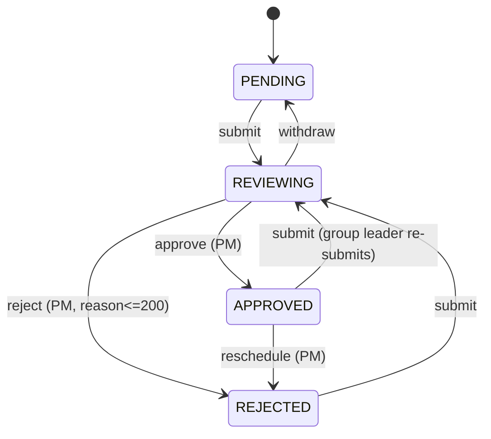

# OA 平台 MVP 架构与 Agent 开发计划

## 1. MVP 范围决策

保留（首版必做）：
- 用户/角色（`GroupLeader` / `ProjectManager`）— 以 header 切换角色的 mock 登录
- 项目 / 迭代 / 小组 WBS 排期表
- 排期状态机：`Pending → Reviewing → Approved | Rejected`；`Approved → Rejected`（重新排期）
- WBS 表格 Excel 级交互（MVP 口径：单元格编辑、多选、复制/粘贴、撤销/重做、`Alt+Enter` 换行、列冻结、右键增删行）
- 30s 自动保存（草稿）
- 主从双向同步（Approved 汇总到总表；PM 在总表新增/删除手动行回写至组）
- 任务依赖：1-to-1、DFS 循环检测、按工作日历的时间联动
- PM 审批（同意/拒绝 + 200 字理由 / 重新排期）

以 **stub** 形式留接口（有契约 + 基础测试，但不做完整实现）：
- 钉钉通知（落地为 `NotificationOutbox` 事件表 + 控制台日志）
- 导出 `.xlsx`（返回 mock 文件，验证路由与权限即可）
- 备忘录（纯文本版，富文本与图片上传留扩展）
- 法定节假日日历（内置"周末 + 一个可配置假日表"，MVP 不接第三方 API）

不做：真实 SSO、审计日志全量、高并发锁服务（用乐观锁 `version` 字段即可）。

## 2. 仓库结构（pnpm workspaces 单仓多包）

```
/
├── packages/
│   ├── shared/           # zod schema、TS 类型、状态机/依赖/日历纯函数
│   ├── backend/          # NestJS + Prisma
│   └── frontend/         # Vite + React + TS + Tailwind
├── e2e/                  # Playwright（独立 package）
├── tools/
│   └── docx-extract/     # Python 脚本：抽取 .docx 图片与顺序索引
├── docs/
│   ├── PLAN.md           # 本文件的精炼版本（Agent 每次任务的单一事实源）
│   ├── ARCHITECTURE.md   # 架构图、数据模型、状态机图
│   ├── TDD-GUIDE.md      # TDD 节奏与模板（红/绿/重构 + 每层样例）
│   ├── TASKS/            # 每个原子任务一个 .md，含验收标准与测试先行清单
│   └── assets/ui-ref/    # docx-extract 产出的 UI 参考图
├── docker-compose.yml    # Postgres
├── package.json
├── requirement.md
└── OA平台项目管理需求规格说明书20260417.docx
```

## 3. 领域模型（Prisma 关键实体）

```prisma
model User    { id, name, role: Role, groupId? }           // Role = GROUP_LEADER | PM
model Group   { id, name, members User[] }
model Project { id, name, iterations Iteration[] }
model Iteration { id, projectId, name, startDate, endDate }
model GroupSchedule {
  id, iterationId, groupId,
  status: ScheduleStatus,           // PENDING|REVIEWING|APPROVED|REJECTED
  version Int,                      // 乐观锁 + 覆盖风险检测
  rejectReason String?
  tasks Task[]
}
model Task {
  id, scheduleId, orderIndex, name, ownerId,
  startDate, endDate, durationDays,
  dependencyTaskId String?,         // 1-to-1 约束由应用层保证
  source: TaskSource,               // GROUP | MASTER（PM 在总表新增）
}
model ApprovalRecord { id, scheduleId, reviewerId, action, reason, at }
model NotificationOutbox { id, type, payload Json, dispatchedAt? }  // 钉钉 stub 出口
```

总表 = `SELECT * FROM Task WHERE schedule.status = APPROVED UNION ALL source = MASTER`（视图/服务层组装）。

## 4. 状态机（唯一真源，放 `packages/shared`）



`canTransition(from, to, actor)` 是纯函数，首批 TDD 对象。

## 5. TDD 策略（四层金字塔）

- **L1 Domain Unit (shared)**：Jest，纯函数；先写失败用例。关键对象：`stateMachine`、`detectCycle(tasks)`、`propagateSchedule(tasks, calendar)`、`permissions(role, resource, action)`。
- **L2 Backend Service/Controller**：Jest + `@nestjs/testing` + 测试 Postgres（docker-compose 的独立 schema），每个 service 红灯先于实现。
- **L3 Frontend Component**：Vitest + React Testing Library；WBS 表格的交互行为（键盘、粘贴、自动保存触发）用 `user-event` 驱动。
- **L4 E2E**：Playwright，跨角色多 tab（`browserContext` 双会话）验证主从同步、覆盖风险弹窗等真实路径。

每个任务卡的固定节奏：`写验收 E2E（红）→ 写服务/组件测试（红）→ 实现（绿）→ 重构`。

> 本节只给出分层策略，具体的 **DT / FT / E2E 三层用例目录 + 需求追溯矩阵**见【附录 A】，并会固化为 `docs/TEST-PLAN.md`，每个 feature 目录下放 `__tests__/casebook.md` 引用该 ID。

## 6. 端到端测试清单（Playwright 场景）

1. Group Leader 创建排期、编辑、30s 内触发自动保存（断言 `PATCH /schedules/:id/draft`）。
2. 组长提交 → PM 收到"待办"→ 同意 → 数据出现在主表。
3. PM 拒绝（理由 < 10 字应被拦截，> 200 字应被截断提示），状态机走 `REJECTED`。
4. PM 在已审批状态下"重新排期"，组长页面收到覆盖风险提示。
5. PM 在总表新增一行并保存 → 组长排期表末尾出现该行；删除"系统同步行"被拒。
6. 配置 `A → B → A` 依赖被拦截（弹窗文案断言）。
7. 修改 B 的完成时间，A（其下游）起始时间按工作日历重算（跨周末验证）。
8. 两浏览器上下文模拟组长编辑中，PM 点击"重新排期"出现冲突提示。

## 7. Agent-Friendly 任务分解（每个任务 1–3 小时粒度）

每个任务卡独立落在 `docs/TASKS/Txx-*.md`，结构统一：`目标 / 前置 / 先写的测试 / 实现要点 / 验收清单 / 不做什么`。

- **阶段 0 — 脚手架**
  - T0.1 pnpm 单仓 + ESLint/Prettier + CI（GitHub Actions：lint/test/e2e）
  - T0.2 `packages/shared` 类型 + zod schema
  - T0.3 NestJS + Prisma + docker-compose Postgres + 基础 seed
  - T0.4 Vite + React + Tailwind + 路由 + mock 登录（header `X-User-Id`）
  - T0.5 Playwright 初始化（`e2e` 包 + 一条冒烟用例）
  - T0.6 `tools/docx-extract/` Python 脚本（见 §8）
- **阶段 1 — 领域核心（纯函数，100% TDD）**
  - T1.1 状态机转换 + 角色守卫
  - T1.2 依赖图 1-to-1 约束 + DFS 循环检测
  - T1.3 工作日历 + 时间联动（周末/节假日/持续天数）
  - T1.4 权限矩阵
- **阶段 2 — 后端 API（TDD）**
  - T2.1 Project/Iteration CRUD
  - T2.2 GroupSchedule CRUD + 草稿自动保存（乐观锁 `version`）
  - T2.3 Task CRUD（增删行、排序、字段校验）
  - T2.4 状态机端点：`submit / withdraw / approve / reject / reschedule`
  - T2.5 Dependency 端点（复用 T1.2/T1.3）
  - T2.6 Master 视图 + PM 新增/删除 `MASTER` 行（删除约束）
  - T2.7 `NotificationOutbox` + 钉钉 stub worker（仅写表 + 日志）
  - T2.8 Export stub（返回固定 xlsx buffer + 权限校验）
- **阶段 3 — 前端（组件优先 TDD）**
  - T3.1 角色切换器 + 项目/迭代侧边树
  - T3.2 WBS 表格骨架（基于 `@tanstack/react-table` + 自建键盘层；避免引入重量级商业表格）
  - T3.3 WBS 表格交互：选择/复制/粘贴/Undo-Redo/`Alt+Enter`/冻结/右键菜单
  - T3.4 `useAutoSave` Hook（30s 节流 + 失败重试 + 冲突提示）
  - T3.5 审批面板（提交/撤回/同意/拒绝/重新排期 + 理由校验）
  - T3.6 依赖选择器（点击单元格 → 其他列置灰 → 目标行高亮）
  - T3.7 总表页面（PM 新增/删除行，行来源徽标）
- **阶段 4 — E2E（Playwright）**
  - T4.1–T4.8 对应 §6 的 8 条场景，一人一卡。
- **阶段 5 — 打磨 & 交付**
  - T5.1 种子数据 & README 运行指引
  - T5.2 覆盖率阈值（domain ≥ 95%、backend ≥ 80%、frontend 关键组件 ≥ 70%）
  - T5.3 `docs/ARCHITECTURE.md` 定稿，UI 参考图嵌入

## 8. `tools/docx-extract` Python 脚本设计

- 依赖：`python-docx`、`Pillow`（可选做缩略图）、`pyyaml`。
- 逻辑：打开 `.docx`（本质是 zip），遍历 `word/media/*`，按 `document.xml` 中 `<w:drawing>` 的出现顺序建立「段落序号 → 图片文件名 → 最近 heading」索引，输出：
  - 图片原始文件拷贝到 `docs/assets/ui-ref/imgXX.png`
  - `docs/assets/ui-ref/index.yaml`：`[{ file, order, section_path: ["3. 小组排期功能逻辑", "3.2 ..."], caption_guess }]`
  - 一份 `docs/assets/ui-ref/README.md`：缩略图 + 章节上下文，供前端 Agent 设计界面时引用。
- 运行方式：`python tools/docx-extract/extract.py OA平台项目管理需求规格说明书20260417.docx`。
- TDD：对小型 fixture `.docx` 写 2 条 `pytest`（图片数、顺序索引正确）。

## 9. 交付物一览（计划确认后开工顺序）

1. 创建 `docs/PLAN.md` / `docs/ARCHITECTURE.md` / `docs/TDD-GUIDE.md` / `docs/TEST-PLAN.md` / `docs/TASKS/*.md`（本计划与附录 A 的固化版本 + 每张任务卡）。
2. 跑 `tools/docx-extract/` 产出 `docs/assets/ui-ref/`。
3. 按阶段 0 → 5 的任务卡依次执行，每卡严格 TDD，且必须回填 `docs/TEST-PLAN.md` 中对应用例 ID 的实现/通过状态。

## 10. 关键风险与缓解

- **Excel 级表格复杂度**：限定 MVP 交互清单，复杂格式/公式明确不做；选型 `@tanstack/react-table` + 自建键盘/选区层可控。
- **并发编辑**：`version` 乐观锁 + 提交时 412 冲突 UI，不引入 CRDT。
- **时间联动正确性**：工作日历做成可注入的纯函数，便于节假日表替换与测试矩阵覆盖。
- **钉钉依赖**：Outbox 模式彻底解耦，后续切真实通道零业务改动。

---

## 附录 A — DT / FT / E2E 三层测试设计

### A.0 三层分工与纪律

- **DT (Developer Test)** — 白盒单元测试。目标：纯函数、单类、单 hook；**无 I/O、无 DB、无网络**；单条 < 50ms；提交前本地必须全绿；必须覆盖分支、边界、异常路径。工具：Jest（`packages/shared`、`backend/**/*.spec.ts`）、Vitest（`frontend/**/*.test.tsx`）、pytest（`tools/docx-extract`）。
- **FT (Functional Test)** — 黑盒功能测试。后端：`@nestjs/testing` + 独立 Postgres test schema，验证 API 契约与业务规则（不测 UI 细节）；前端：RTL + MSW，验证组件行为与状态契约（不启真实后端）。单条 < 2s；按 feature 成套组织。
- **E2E** — Playwright 驱动真实浏览器 + 真实后端 + 真实 DB（种子 + 逐例重置）。用多 `browserContext` 模拟多角色并发；断言**用户可观测信号**（文案 / 路由 / 网络调用 / 数据库副作用通过 dev 接口可见）。

共同纪律：
- 每条需求至少命中两层；`§3.1 状态机`、`§4.2 删除约束`、`§5.1 循环检测` 三大硬规则必须三层全覆盖。
- 用例 ID 命名：`<LAYER>-<DOMAIN>-<NN>`，例：`DT-SM-07`、`FT-MASTER-02`、`E2E-DEP-03`。
- 缺陷修复必须**先补一条复现用例**（优先 DT，退而 FT；E2E 只作二次保险）。
- PR 必须附「用例 ID checklist」关联新增/修改。

### A.1 需求-用例追溯矩阵

- `§1.2` 角色权限矩阵 → DT-PERM-01..04 · FT-PERM-01..02, FT-AUTH-01..02 · E2E-PERM-01..02
- `§2.1` 模块入口导航 → FT-NAV-01..02 · E2E-NAV-01
- `§3.1` 状态机（4 个状态） → DT-SM-01..12 · FT-SM-01..06 · E2E-SM-01..04 【P0】
- `§3.2` 双击入口 / 详情页 → FT-NAV-02 · E2E-NAV-01
- `§3.2` Excel 级表格（快捷键、拖选、换行、冻结、格式） → DT-TBL-01..08 · FT-TBL-01..05 · E2E-TBL-01..02
- `§3.3` 自动保存 30s → DT-SAVE-01..03 · FT-SAVE-01..02 · E2E-SAVE-01
- `§3.3` 提交 / 撤回 触发器 → DT-SM-05..08 · FT-SM-01..04 · E2E-SM-01
- `§4.1-4.2` 主从同步（Master↔Group） → FT-MASTER-01..06 · E2E-MASTER-01..02 【P0】
- `§4.2` 删除约束（系统同步行不可删） → DT-TBL-07 · FT-MASTER-04 · E2E-MASTER-02 【P0】
- `§4.3` 审批（同意/拒绝 + 200 字理由） → DT-SM-09..10 · FT-APPROVE-01..03 · E2E-SM-02..03
- `§4.3` 重新排期 + 覆盖风险 → DT-SM-11 · FT-RESCHED-01 · E2E-SM-04
- `§5.1` 1-to-1 / 循环检测 / 时间联动 → DT-DEP-01..06, DT-CAL-01..08 · FT-DEP-01..05 · E2E-DEP-01..03 【P0】
- `§5.2` 依赖交互流程 → FT-TBL-04 · E2E-DEP-04
- `§6.1` 备忘录（stub） → FT-MEMO-01..02
- `§6.2` 导出（stub） → FT-EXP-01..02
- 派生 · 并发乐观锁 → DT-LOCK-01 · FT-SAVE-02, FT-LOCK-01 · E2E-LOCK-01
- 派生 · 钉钉 Outbox → DT-OBX-01 · FT-OBX-01..02 · E2E-NOTIF-01

### A.2 DT（Developer Test）用例清单

#### A.2.1 状态机 `stateMachine.canTransition(from, to, actor, ctx)` — 12 条
- **DT-SM-01** PENDING → REVIEWING by GL，任务非空 → 允许
- **DT-SM-02** PENDING → REVIEWING，任务为空 → 拒绝，code `CONTENT_EMPTY`
- **DT-SM-03** REJECTED → REVIEWING by GL → 允许（重新提交）
- **DT-SM-04** APPROVED → REVIEWING by GL → 允许（再次修改提交）
- **DT-SM-05** REVIEWING → PENDING by GL（撤回） → 允许
- **DT-SM-06** REVIEWING → PENDING by PM → 拒绝，`ACTOR_NOT_OWNER`
- **DT-SM-07** REVIEWING → APPROVED by PM → 允许
- **DT-SM-08** REVIEWING → APPROVED by GL → 拒绝，`ACTOR_NOT_PM`
- **DT-SM-09** REVIEWING → REJECTED by PM，reason 长度 ∈ [1,200] → 允许
- **DT-SM-10** REVIEWING → REJECTED，reason 空或 >200 → 拒绝，`REASON_INVALID`
- **DT-SM-11** APPROVED → REJECTED by PM（reschedule） → 允许
- **DT-SM-12** PENDING → APPROVED（跳过 REVIEWING） → 拒绝，`INVALID_TRANSITION`

#### A.2.2 权限矩阵 `permissions(role, resource, action)` — 4 条
- **DT-PERM-01** GL 对本组 schedule：edit/submit/withdraw allow，approve deny
- **DT-PERM-02** GL 对他组 schedule：read allow，edit deny
- **DT-PERM-03** PM 对任意 schedule：read/approve/reject/reschedule allow，直接改任务字段 deny
- **DT-PERM-04** PM 对 master：addRow allow；deleteRow 仅 source=MASTER 时 allow

#### A.2.3 依赖图 `detectCycle(graph)` + `setDependency` — 6 条
- **DT-DEP-01** 空图 → 无环
- **DT-DEP-02** 自环 A→A → `CYCLE_SELF`
- **DT-DEP-03** 二节点 A→B→A → `CYCLE`，返回回路 `[A,B,A]`
- **DT-DEP-04** 链式 A→B→C→A → `CYCLE`，返回完整回路
- **DT-DEP-05** DAG A→B, A→C, B→D → 无环
- **DT-DEP-06** 已有依赖的任务设第二前置 → `ONE_TO_ONE_VIOLATION`

#### A.2.4 工作日历 & 时间联动 — 8 条
- **DT-CAL-01** `addWorkDays(周一, 1) = 周二`
- **DT-CAL-02** `addWorkDays(周五, 1) = 下周一`（跳过周末）
- **DT-CAL-03** `addWorkDays(周五, 3) = 下周三`
- **DT-CAL-04** 注入周五为法定假日：`addWorkDays(周四, 2) = 下周二`
- **DT-CAL-05** duration=0 → 同日返回
- **DT-CAL-06** 下游任务 `start = dep.finish + 1 workDay`
- **DT-CAL-07** 链式传播 B.finish 变更 → C、D 级联；非下游不动
- **DT-CAL-08** 上游 finish 提前 → 下游 start 也前移，保持 +1 WD 偏移

#### A.2.5 WBS 表格纯逻辑 — 8 条
- **DT-TBL-01** `normalizeRange` 规整任意方向拖选为 `{r1≤r2,c1≤c2}`
- **DT-TBL-02** 复制生成 TSV，换行字段用 `"` 包裹并转义
- **DT-TBL-03** TSV 粘贴映射：目标小于源 → 左上对齐 + 返回 `overflow` 行列数
- **DT-TBL-04** undo/redo 栈上限 50，溢出丢最旧
- **DT-TBL-05** Alt+Enter 在值中插入 `\n`，不触发提交
- **DT-TBL-06** `insertRowBelow(i)` 重排 `orderIndex`，保证稳定序
- **DT-TBL-07** `canDeleteRow(task, schedule)`：source=MASTER → true；source=GROUP 且 schedule 非 PENDING/REJECTED → false
- **DT-TBL-08** 冻结前 N 列 → 列布局 metadata 标 `stickyLeft`

#### A.2.6 自动保存 `useAutoSave(deps, saveFn)` — 3 条
- **DT-SAVE-01** 编辑后 30s 触发 saveFn；期间再次编辑则重新计时
- **DT-SAVE-02** 组件卸载取消未触发的定时器，无 "leak"
- **DT-SAVE-03** saveFn 连续失败 → 指数退避重试 ≤3 次，再失败抛给 UI

#### A.2.7 乐观锁 & Outbox — 2 条
- **DT-LOCK-01** `applyPatch(current, patch, version)`：version 不一致 → `VERSION_CONFLICT`
- **DT-OBX-01** `buildNotification(type, payload)` 幂等键 = `type|scheduleId|action|version`；同键重复构造结果一致

#### A.2.8 docx-extract（pytest） — 2 条
- **DT-DOCX-01** Fixture .docx 含 3 张图 → 输出 3 个 png + index.yaml 3 条
- **DT-DOCX-02** index 中 `section_path` 正确回溯到最近 Heading 1/2

### A.3 FT（Functional Test）用例清单

#### A.3.1 鉴权与导航
- **FT-AUTH-01** 无 `X-User-Id` 访问任意受保护接口 → 401
- **FT-AUTH-02** GL 访问 `POST /master/:iterationId/rows` → 403
- **FT-NAV-01** `GET /projects`：返回项目+迭代树，按角色过滤可见范围
- **FT-NAV-02** `GET /iterations/:id`：返回该迭代下各组排期状态摘要（对应 §3.2 双击入口）

#### A.3.2 排期状态机（API）
- **FT-SM-01** `POST /schedules/:id/submit`（PENDING + 非空） → 200，version+1，Outbox 新增 `SCHEDULE_SUBMITTED`
- **FT-SM-02** `POST /submit` 空任务 → 422 `CONTENT_EMPTY`
- **FT-SM-03** `POST /withdraw`（REVIEWING） → 200；Outbox `SCHEDULE_SUBMITTED` 置 `dismissedAt`
- **FT-SM-04** `POST /withdraw` 非 REVIEWING → 409 `INVALID_STATE`
- **FT-SM-05** `POST /approve` by PM → status=APPROVED，写 ApprovalRecord，master 视图立即可见
- **FT-SM-06** `POST /reject` reason 空/>200 → 422

#### A.3.3 草稿与乐观锁
- **FT-SAVE-01** `PATCH /schedules/:id/draft` version 匹配 → 200，返回 version+1
- **FT-SAVE-02** 并发 2 次 `PATCH`，后者 version 旧 → 409，载荷含 `latestVersion`
- **FT-LOCK-01** PM 发起 reschedule 时检测到 GL 在编辑（draft version 已变） → 返回 `OVERWRITE_RISK` + diff

#### A.3.4 任务与依赖
- **FT-DEP-01** `PUT /tasks/:id/dependency` 有效依赖 → 200，任务图含新边
- **FT-DEP-02** 建立导致循环 → 422 `CYCLE` + 回路 ids
- **FT-DEP-03** 有依赖的任务再加第二前置 → 422 `ONE_TO_ONE_VIOLATION`
- **FT-DEP-04** 上游 finish 变更 → `PATCH /tasks/:id` 返回受影响下游 diff 列表
- **FT-DEP-05** 跨组依赖：下游组未审批 → 仍返回重算结果，标 `pendingRecalc=true`

#### A.3.5 主从同步
- **FT-MASTER-01** approve 后 `GET /master/:iterationId` 含该组任务，source=GROUP，顺序与组内一致
- **FT-MASTER-02** `POST /master/:iterationId/rows`（PM）指定 ownerId → 在对应组末尾追加 source=MASTER；Outbox 写入 2 条（负责人 + 组长）
- **FT-MASTER-03** GL `GET /schedules/:id` 看到 source=MASTER 任务在末尾，含只读字段清单
- **FT-MASTER-04** `DELETE /master/rows/:taskId`：source=MASTER → 200；source=GROUP → 422 `SYNC_ROW_READONLY`【P0】
- **FT-MASTER-05** reschedule 后该组任务从 master 视图移除
- **FT-MASTER-06** source=MASTER 行负责人变更由 PM 发起 allow；由 GL 发起 403

#### A.3.6 审批与重新排期
- **FT-APPROVE-01** 非 PM 发起 approve → 403
- **FT-APPROVE-02** reject 持久化 reason 到 ApprovalRecord；可查询历史
- **FT-APPROVE-03** 同迭代同组多次 approve（重新提交后） → 以最新 version 为准
- **FT-RESCHED-01** PM reschedule → 写 Outbox 给 GL；master 移除；返回变更前后 snapshot

#### A.3.7 表格功能（组件 FT）
- **FT-TBL-01** 粘贴 3×2 到 2×3 目标 → 左上对齐 + toast "列被裁剪"
- **FT-TBL-02** Undo 50 次后第 51 次不可再回退（按钮 disabled）
- **FT-TBL-03** Ctrl+B 加粗：视觉变化，保存 payload 不含字体字段（MVP 不持久化格式）
- **FT-TBL-04** 点击"选择依赖项" → 其他列 `aria-disabled=true` + 目标列高亮；Esc 退出
- **FT-TBL-05** 冻结首列后水平滚动 → 首列保留 sticky；右键菜单包含"插入/删除行"

#### A.3.8 Outbox & 通知（stub）
- **FT-OBX-01** Outbox worker tick 后 `dispatchedAt` 非空；控制台输出结构化 JSON
- **FT-OBX-02** 同幂等键连续入列 → 仅保留最新未派发

#### A.3.9 导出 & 备忘录（stub）
- **FT-EXP-01** `GET /exports/iterations/:id.xlsx` 返回正确 content-type、非空 body
- **FT-EXP-02** GL 请求导出非本组总表 → 403
- **FT-MEMO-01** memo CRUD 最小契约（create/get/update）
- **FT-MEMO-02** 关闭未保存 memo：hook 暴露 `isDirty=true`，前端 route guard 对应弹窗可被驱动

### A.4 E2E（Playwright）用例清单

**通用 fixture**：`seed.ts` 初始化 1 项目 / 1 迭代 / 2 组（G1/G2） / 2 GL（U1/U2） / 1 PM（P1）；通过 `X-User-Id` header 登录；每例 `beforeEach` 重置 DB；所有 P0 用例打 `@p0` tag，主干构建阻塞门禁。

- **E2E-PERM-01** GL U1 打开 G2 的排期页 → 编辑区 readOnly、工具栏只剩"查看"
- **E2E-PERM-02** PM 打开任一组 → 审批按钮可见、任务单元格编辑被屏蔽
- **E2E-NAV-01** 登录 → 侧边树 → 双击迭代 → 路由 `/projects/:p/iterations/:i`，各组状态徽标匹配种子
- **E2E-SM-01** 【@p0】GL 编辑 → ≥30s 后断言 `PATCH .../draft` 已发送 → 点提交 → toast "已提交"；PM 侧 badge +1
- **E2E-SM-02** 【@p0】PM approve → `/master` 页出现该组任务，顺序一致
- **E2E-SM-03** PM reject：reason 为空时按钮 disabled；填 10 字 → 提交成功；GL 侧显示 REJECTED + reason
- **E2E-SM-04** 双 context 冲突：GL 正在编辑；PM 点 reschedule → PM 侧出现 `OVERWRITE_RISK` 弹窗；GL 侧出现 banner "PM 发起重新排期"
- **E2E-TBL-01** 复制 3×3 TSV → 选中 1×1 粘贴 → 展开成 3×3；Ctrl+Z 两次完全回滚
- **E2E-TBL-02** 在备注列 Alt+Enter 插入换行 → 显示两行；冻结首列后水平滚动首列仍可见
- **E2E-SAVE-01** 底部出现 "已自动保存 HH:mm:ss"；断网后重试 3 次失败 → 红色错误条 + 手动重试按钮
- **E2E-MASTER-01** PM 在总表新增 1 行、指定 owner → 切 GL 视图：任务在组末尾、负责人正确；`/dev/outbox` 观察到 2 条通知
- **E2E-MASTER-02** 【@p0】PM 删除 source=MASTER 成功；删除 source=GROUP → toast "系统同步行不可删除"；DB 数据未变
- **E2E-DEP-01** 【@p0】GL 设 T2 依赖 T1 → 保存成功 + 箭头可见
- **E2E-DEP-02** 【@p0】GL 设 T1 依赖 T2（已存在 T2 依赖 T1） → 弹窗"存在循环依赖：T1→T2→T1"，保存被拦截
- **E2E-DEP-03** T1 finish 从周五改周二 → T2 start 变下周一（跨周末），变更单元格高亮
- **E2E-DEP-04** 点"选择依赖项" → 其他列置灰；点目标行 → 当前行显示依赖标识；Esc 取消
- **E2E-LOCK-01** 两 GL tab 同时编辑同一单元格 → 后提交者看到版本冲突提示 + 刷新/合并按钮
- **E2E-NOTIF-01** 走完 submit→approve→reschedule 全链路 → `/dev/outbox` 观察到 4 条 notification 均 `dispatchedAt` 非空

### A.5 CI / 质量门 / 度量

- CI 三段：① `lint + DT`（每次 push） → ② `FT`（PR 必跑） → ③ `E2E`（PR + main，`@p0` 永远跑、其它用 sharding）
- 覆盖率阈值：`shared` ≥ 95%，`backend` service 层 ≥ 85%，`frontend` 关键交互组件 ≥ 75%；低于阈值 CI 失败
- P0 用例（`§3.1` 状态机、`§4.2` 删除约束、`§5.1` 循环检测）任一失败阻塞发布
- 每个 Task 卡模板强制列出"本卡命中的用例 ID"；PR 描述附「用例 ID checklist」
- 每两周一次「测试债务评审」：合并/重写重复用例，保持金字塔形状（DT ≫ FT ≫ E2E，目标比例 70/20/10）
- Bug 修复工作流：复现 → 先写失败用例（DT 优先）→ 修 → 挂 bug-link 标签
